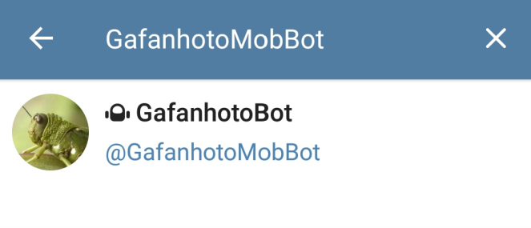
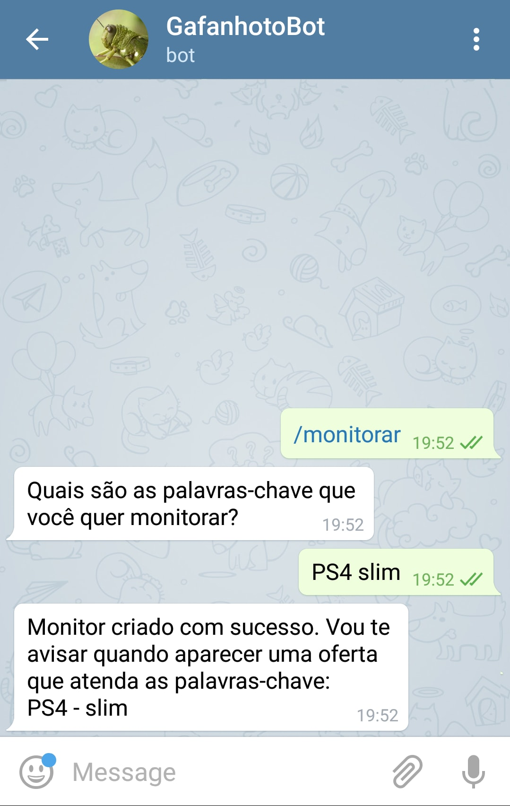
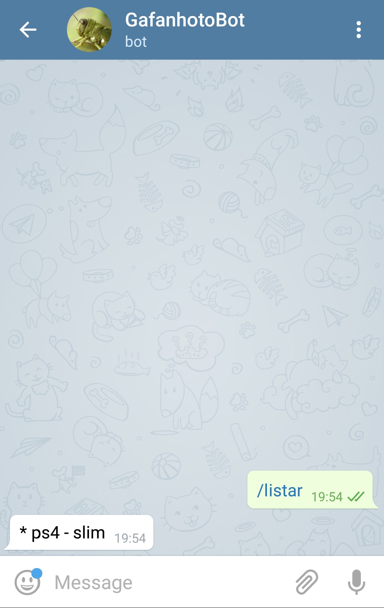
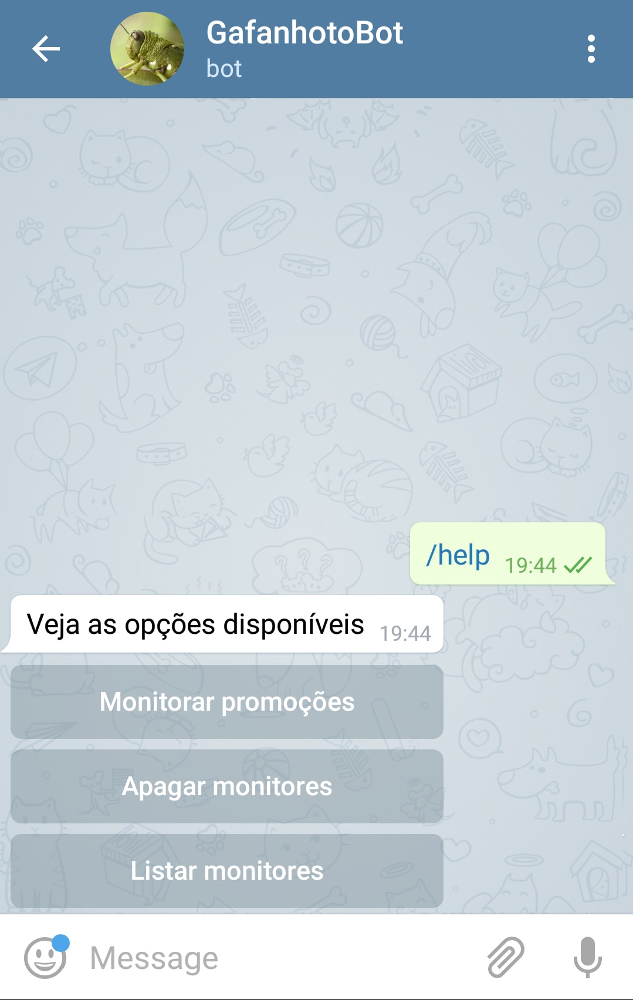

# Gafanhoto 
     

> Bot para monitoramento de promoções no fórum do Hardmob

  

## Objetivo
O Gafanhoto tem por objetivo buscar e armazenar as urls dos tópicos, postados no fórum de promoções do Hardmob. Além disso ele possibilita através do chat do Telegram,   que pessoas cadastrem monitores com palavras-chave, para serem avisadas quando surgirem promoções.

  

## Iniciando
Acesse a área de pesquisa de usuários no Telegram, e pesquise por `GafanhotoMobBot`.

  

Ao iniciar a conversa, clique no botão `start` e as instruções serão apresentadas.

## Monitorando
Digite o comando `/monitorar` e será perguntado quais palavras-chave você deseja monitorar. Quanto mais palavras-chave, mais específica será a busca.

  

## Listando os monitores
Digite o comando `/listar` e serão apresentados os monitores que você possui cadastrados.

  

## Apagando os monitores
Se você não deseja monitorar um certo conjunto de palavras-chave, utilize o comando `apagar` e escolha um monitor para excluir.

  

## Ajuda
A qualquer momento digite `/help` para que sejam exibidos todos os comandos disponíveis, caso você não se lembre de algum.

  

